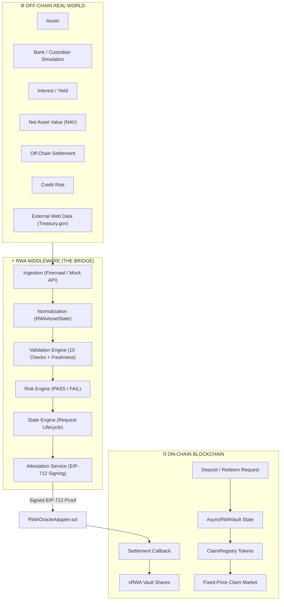

# System Architecture Specification

> **Asynchronous settlement and liquidity infrastructure for tokenized Real-World Assets (RWAs).**

### 🎯 Core Positioning Principle
- **ERC-7540** handles the asynchronous vault.
- **Our middleware** handles asynchronous real-world state.
- **The claim market** handles the liquidity gap.

---

## Overview

Tokenized Real-World Assets (RWAs)—such as US Treasury bills, corporate debt, and private credit—cannot operate under standard DeFi vault assumptions. This document explains the architectural rationale behind the 3-layer design of the **Asynchronous RWA Vault Infrastructure** bridges this gap across three core domains, with the Middleware serving as the explicit bridge:



---

## 🏛 Core Architectural Justifications

### 1. Why ERC-4626 Alone is Insufficient
Standard ERC-4626 vaults assume atomic and synchronous execution:
- `deposit(assets) -> immediate mint(shares)`
- `redeem(shares) -> immediate withdraw(assets)`

In traditional DeFi (e.g. lending protocols or DEX liquidity pools), tokenized assets live natively on-chain, allowing instant settlement within a single EVM transaction block.

Real-World Assets, however, depend on off-chain banking rails, Fedwire/ACH settlement windows, physical custodian verifications, and delayed Net Asset Value (NAV) updates. Operating an RWA vault under standard ERC-4626 creates severe vulnerabilities:
- **Premature Minting Risk**: Minting shares before cash settles at bank custodians allows depositors to exploit vault NAV before collateral is secured.
- **Atomic Failure**: If off-chain wire transfers fail or freeze, the vault is left under-collateralized with unbacked minted shares.

---

### 2. Why ERC-7540 is Used
ERC-7540 extends ERC-4626 specifically to introduce **Asynchronous Deposit & Redemption Requests**:
- **Separation of Intent & Settlement**: Submitting a deposit request (`requestDeposit()`) transfers collateral to the vault contract but issues **zero shares** immediately.
- **Request Sequencing**: Deposit requests enter a `PENDING` queue on-chain.
- **Conditional Finalization**: Vault shares (`vRWA`) are minted **only after** an asynchronous callback confirms off-chain banking and custody settlement.

This guarantees the fundamental invariant:
```
req.state == PENDING  ==>  req.claimableShares == 0
```

---

### 3. Why Middleware is Necessary
Smart contracts operating on EVM cannot directly query external HTTP endpoints, inspect PDF audit reports, or parse web data. The **RWA State Middleware** serves as an off-chain computation engine that:
1. **Normalizes Heterogeneous Data**: Converts diverse bank feeds, web pages, and API payloads into standardized `RWAAssetState` objects.
2. **Enforces Quality & Freshness**: Rejects data payloads with timestamps older than `MAX_DATA_AGE_SECONDS` (5 minutes).
3. **Applies Risk Policies**: Evaluates credit posture and custody verification status deterministically, returning explicit pass/fail reasons (`STALE_DATA`, `CUSTODY_NOT_VERIFIED`, etc.).

---

### 4. Why Firecrawl is Only an Ingestion Layer
Firecrawl provides web scraping and data extraction capabilities to pull reference information from public sources (e.g. Treasury.gov). However, Firecrawl is strictly an **ingestion tool**, not an oracle:
- **Unverified External Inputs**: Web scrapers capture raw data; they do not cryptographically sign or validate credit risk.
- **No Direct Contract Link**: Raw web extraction feeds are **never** passed directly to smart contracts (`Firecrawl ⇏ Blockchain`).
- **Explicit UI Labeling**: Data sourced from web scrapers is labeled as `"External Reference Data"`, never `"Official Oracle"`.
- **Fail-Closed Fallback**: If Firecrawl fails or times out, the middleware gracefully falls back to mock providers or halts settlement safely (`Delay is a successful outcome`).

---

### 5. Why Attestation is Necessary
To bridge off-chain middleware verification with on-chain smart contract execution safely, the protocol utilizes **EIP-712 Typed Structured Data Attestations**:
- **Cryptographic Provenance**: The middleware signs structured state parameters (`assetId`, `requestId`, `nav`, `yieldRate`, `riskStatus`, `nonce`, `timestamp`) using `ATTESTER_PRIVATE_KEY`.
- **On-Chain Signature Verification**: `RWAOracleAdapter.sol` uses `ECDSA.recover` to verify the signer on-chain (`recoveredSigner == attesterSigner`).
- **Replay & Nonce Defense**: Each attestation includes a unique nonce (`usedNonces[nonce]`) and timestamp check (`block.timestamp <= timestamp + maxDataAge`), preventing attackers from replaying stale settlement approvals.

---

### 6. Why Claim Markets Solve the Liquidity Gap
While ERC-7540 protects vault solvency by introducing a T+1 to T+3 settlement queue, it creates a user experience friction: **depositors must wait for off-chain settlement before receiving liquidity**.

The **Fixed-Price Claim Market** (`ClaimMarket.sol` & `ClaimRegistry.sol`) solves this temporal mismatch:
- **Tokenized Claims**: Each pending deposit request creates a claim token in `ClaimRegistry`.
- **Secondary Discount Exit**: A depositor needing immediate cash sells their claim to a secondary buyer at a small discount (e.g. 2% discount for 980 USDC on a 1,000 USDC claim).
- **T+0 Cashflow**: The seller receives 980 USDC immediately, while the buyer acquires the future right to the 1,000 vault shares upon settlement.
- **Zero Vault Repricing**: The underlying vault asset remains locked in its normal settlement timetable without requiring forced liquidations.

---

### 7. Why Asynchronous State Transitions Require Additional Testing
Synchronous contracts execute state changes atomically within single transactions. Asynchronous state machines, by contrast, split lifecycle steps across multiple independent transactions and off-chain messages:

```
REQUESTED ──> PENDING ──> VERIFIED ──> SETTLED ──> CLAIMABLE ──> FINALIZED
```

This multi-step asynchronous flow introduces unique attack surfaces that require dedicated security testing:
- **State Regression Attacks**: Preventing an attacker from re-submitting an attestation to push a `FINALIZED` request back to `CLAIMABLE`.
- **Double Claims & Double Settlements**: Ensuring that `claimShares()` can only be called once, zeroing out `claimableShares` before share minting.
- **Direct Callback Bypasses**: Verifying that unauthorized external actors cannot directly invoke vault callbacks (`onAttestationSettled`) without going through `RWAOracleAdapter.sol`.
- **Reentrancy across Async Boundaries**: Ensuring that token transfers in the Claim Market cannot re-enter vault or registry state.

The protocol covers all 17 asynchronous security vectors in an automated 18-case test suite (`packages/contracts/test/AsyncRWAVault.test.ts`).

---

## 📐 Implementation Rules & Standards Compliance

1. **Standard OpenZeppelin Primitives**:
   All security primitives—`ReentrancyGuard`, `Pausable`, `Ownable`, `SafeERC20`, `ECDSA`, and `EIP712`—are imported directly from `@openzeppelin/contracts` v5 without duplicating logic or inventing custom security forks.

2. **Strict ERC-7540 Async API Alignment**:
   Async vault methods (`requestDeposit`, `requestRedeem`, `pendingDepositRequest`, `pendingRedeemRequest`, `claimableDepositRequest`, `claimableRedeemRequest`, `claimShares`, `claimAssets`) strictly mirror standard ERC-7540 asynchronous vault semantics.

3. **Modular Layering**:
   - `AsyncRWAVault.sol` handles vault balances & share minting.
   - `RWAOracleAdapter.sol` handles EIP-712 signature verification & nonce tracking.
   - `ClaimRegistry.sol` handles tokenized entitlement claims.
   - `ClaimMarket.sol` handles fixed-price secondary sales.

4. **Zero Proprietary Standard Forks**:
   The protocol adheres to standard EIP-712 typed structured data hashing (`keccak256(...)`) and standard EVM token standards without modifying underlying transfer mechanisms.
