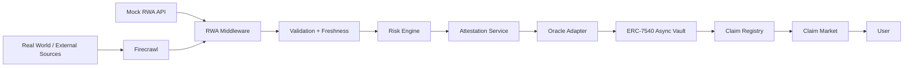

# Data Flow & Trust Boundary Specification

This document details the end-to-end data lifecycle from external real-world reference data to on-chain vault settlement.

---

## 🔀 Complete Data Pipeline Sequence

---

## 🛡 Firecrawl Trust Boundary Rules

1. **Never Direct to Chain**: Raw Firecrawl data is **never** transmitted directly to smart contracts (`Firecrawl ⇏ Blockchain`).
2. **Explicit Labeling**: Firecrawl-sourced attributes in the UI are strictly labeled as `"External Reference Data"`, **never** `"Official Oracle"`.
3. **Backend Key Security**: `FIRECRAWL_API_KEY` is loaded exclusively in Node.js server environments (`process.env.FIRECRAWL_API_KEY`) and is never exposed in client bundles.
4. **Graceful Fallback**: If Firecrawl is unavailable or `FIRECRAWL_API_KEY` is unconfigured, `FirecrawlProvider` automatically falls back to `MockRWAProvider` without throwing uncaught exceptions.
