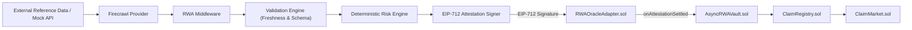

# Data Flow Specification

```mermaid
flowchart LR
    ExternalSource["External Reference Data / Mock API"]
    Firecrawl["Firecrawl Provider"]
    Middleware["RWA Middleware"]
    ValidationEngine["Validation Engine (Freshness & Schema)"]
    RiskEngine["Deterministic Risk Engine"]
    Attester["EIP-712 Attestation Signer"]
    OracleAdapter["RWAOracleAdapter.sol"]
    AsyncVault["AsyncRWAVault.sol"]
    ClaimRegistry["ClaimRegistry.sol"]
    ClaimMarket["ClaimMarket.sol"]

    ExternalSource --> Firecrawl
    Firecrawl --> Middleware
    Middleware --> ValidationEngine
    ValidationEngine --> RiskEngine
    RiskEngine --> Attester
    Attester -- "EIP-712 Signature" --> OracleAdapter
    OracleAdapter -- "onAttestationSettled" --> AsyncVault
    AsyncVault --> ClaimRegistry
    ClaimRegistry --> ClaimMarket
```
